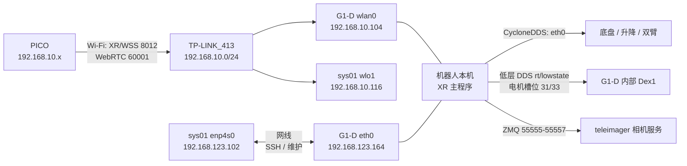

# G1-D XR 网络拓扑与数采运行手册

## 当前现场地址

| 设备 | 接口 | 地址 | 用途 |
|---|---|---|---|
| sys01 工作站 | `enp4s0` | `192.168.123.102/24` | 通过网线访问机器人、维护和传代码 |
| sys01 工作站 | `wlo1` | `192.168.10.116/24` | 接入无线 AP `TP-LINK_413` |
| G1-D 机器人 | `eth0` | `192.168.123.164/24` | DDS、SSH、相机和设备控制网络 |
| G1-D 机器人 | `wlan0` | `192.168.10.104/24` | 向 PICO 提供 XR HTTPS/WSS 和 WebRTC |
| PICO | Wi-Fi | `192.168.10.x/24`（DHCP） | 手柄、头显位姿和视频链路 |

当前 XR 主程序运行在机器人 `/home/unitree/xr_teleoperate_g1d`，因此 PICO 要连接 **`TP-LINK_413` 的 10 网段 Wi-Fi**，获取 `192.168.10.x` 地址，并访问机器人无线地址 `192.168.10.104`。不需要让 PICO 接入 123 网段。



实时链路不经过 sys01：PICO 通过无线直接连接机器人，XR 主程序在机器人本机完成 IK、DDS 控制和 EpisodeWriter 数采。sys01 用于保存源代码、SSH 运维和传输数据。

## 首次初始化

在能够访问 Tailscale 的电脑打开终端，先登录 sys01，再登录机器人：

```bash
ssh sys01@100.74.87.112
ping -c 2 192.168.123.164
ssh unitree@192.168.123.164
```

在机器人终端确认相机服务：

```bash
systemctl is-active teleimager.service
systemctl is-enabled teleimager.service
```

两条结果都应为 `active` / `enabled`。这台 G1-D 使用内部 Dex1 电机，首次部署确认外置串口服务已停用：

```bash
sudo systemctl disable --now dex1_gripper.service
systemctl is-active dex1_gripper.service || true
```

外置 `dex1_1_service` 扫描的是 CH343 串口板卡；本机该路径没有检测到左右电机。G1-D 上电后夹爪自动闭合、且 `rt/lowstate` 的 31/33 槽位有实时反馈，说明应使用内部控制器。

## 每次遥操数采的启动顺序

### 终端 A：机器人服务检查

从 sys01 登录机器人：

```bash
ssh unitree@192.168.123.164
sudo systemctl restart teleimager.service
systemctl is-active teleimager.service
```

显示 `active` 后保留该终端用于看日志：

```bash
sudo journalctl -u teleimager.service -f
```

### 终端 B：启动 XR 遥操和 EpisodeWriter

另开一个 sys01 终端，再次登录机器人：

```bash
ssh unitree@192.168.123.164
cd /home/unitree/xr_teleoperate_g1d
./launch_g1d.sh \
  --record \
  --task-dir /home/unitree/unitree_eai_environment/data \
  --task-name g1d_xr_test \
  --network-interface eth0
```

这里必须指定 `eth0`，确保底盘、升降、双臂和内部 Dex1 的 DDS 走 `192.168.123.0/24`。启动器会先检查 `teleimager.service` 和 8012 端口；如果已有旧的遥操进程占用 8012，会直接提示并退出，避免两个 Vuer 服务互相干扰。启动器默认传入 `--ee=dex1_internal`；看到 `EpisodeWriter initialized successfully` 和 `Please enter the start signal` 后，再进行 PICO 连接。保持终端 B 在前台，后续的 `R/S/Q` 都在这个终端按。

### PICO：连接与进入 VR

1. PICO 连接 Wi-Fi `TP-LINK_413`，确认分配到 `192.168.10.x`。
2. 为让 PICO 先接受自签名证书，分别访问一次 `https://192.168.10.104:8012` 和 `https://192.168.10.104:60001`，选择 `Advanced/继续访问`，随后关闭这两个标签页。8012 是 XR/WSS，60001 是双目 WebRTC。
3. 只打开启动器打印的主地址：`https://vuer.ai?ws=wss://192.168.10.104:8012`。如果 PICO 当前不能访问公网，改用启动器打印的本地备用地址：`https://192.168.10.104:8012/?ws=wss://192.168.10.104:8012`。当前 `display-mode=pass-through`，不需要先打开 60001 相机页面；相机服务仍必须在机器人端运行，因为程序需要它读取配置。
4. 点击 `Virtual Reality`，允许 XR、运动和全屏权限，等待终端 B 出现 `websocket is connected`。默认 `immersive` 模式显示 G1-D 双目头部相机；视频地址必须是 PICO 可达的 `192.168.10.104:60001`。证书已同时包含 `192.168.10.104` 和 `192.168.123.164`。不要同时打开多个 XR 页面或重复点击 `Virtual Reality`。
5. 如果页面白圈超过 10 秒，退出当前 VR、关闭所有同一地址的 PICO 标签页，重新打开唯一的上述 URL；终端 B 仍保持运行，不要重复启动第二个 `launch_g1d.sh`。

XR 服务绑定 `0.0.0.0:8012`，所以使用机器人 `wlan0` 地址访问是有效的。PICO 的 WebSocket 使用无线 10 网段，机器人 DDS 仍使用有线 123 网段，二者不冲突。

## 开始控制和采集

确认机器人周围无障碍物，操作者双臂与机器人初始姿态大致对齐。PICO 手柄操作为：

1. 右手柄 `A`：开始遥操控制；
2. 左手柄 `Y`：开始一个 episode；
3. 执行任务；
4. 再按左手柄 `Y`：结束并保存当前 episode；
5. 听到“采集已保存”后，可以再按左手柄 `Y` 开始下一段；
6. 全部结束后按右手柄 `B`，程序将双臂和腰部回零并退出。

键盘 `R/S/Q` 保留为备用。机器人使用 G1 官方 `voice` 服务，默认用普通话播报系统准备、手柄按键、采集、保存和退出状态；中文播报将 A/B/Y 读作“诶键、比键、歪键”。启动前可设置 `VOICE_LANGUAGE=zh`、`VOICE_LANGUAGE=en` 或 `VOICE_LANGUAGE=bilingual`，也可追加 `--no-voice` 完全关闭语音。按键使用上升沿触发，长按不会重复切换。左 Y 开始一个 episode，再按左 Y 停止并保存；听到保存完成后可继续按左 Y 采集下一个 episode，右 B 只用于结束整个遥操。

控制映射：左摇杆 Y 控制前后，左摇杆 X 控制底盘旋转，右摇杆 Y 控制升降，右摇杆 X 控制腰部 Pitch，左右 Trigger 控制左右 Dex1，左右 Grip 与控制器位姿用于双臂重定向。

`--use-waist` 只启用 14 号 waist pitch 的右摇杆 X 控制；12 号 waist yaw 不跟随摇杆。按 B/Q 正常退出会以限速方式将双臂、waist yaw 和 waist pitch 一并回到 0。`taskset -c 3-7` 只是可选的 CPU 亲和性设置，在本机 0–7 共 8 个逻辑 CPU 中将遥操进程限制到 3–7，不是功能必需项。

内部 Dex1 的反馈位于 `rt/lowstate`：左夹爪为 `motor_state[31]`，右夹爪为 `motor_state[33]`；命令位于 `rt/lowcmd` 的相同下标。用 `sudo /home/unitree/miniconda3/envs/tv/bin/python tools/monitor_dex1.py --mode internal --network-interface eth0` 可只读观察两侧 `q/dq/tau_est/motorstate/temperature`，用于记录全闭和全开端点。遥操采用 `0.0–5.4 rad` 的保守命令范围。

## 数据位置与检查

上述命令的数据目录是：

```text
/home/unitree/unitree_eai_environment/data/g1d_xr_test/episode_XXXX/
```

每段完成后可在另一个机器人终端检查：

```bash
find /home/unitree/unitree_eai_environment/data/g1d_xr_test \
  -maxdepth 2 -type f -name data.json -print
du -sh /home/unitree/unitree_eai_environment/data/g1d_xr_test
```

每帧的 `data.json` 包含原有图像、双臂、末端、Dex1、底盘、升降和腰部字段，以及新增的 `states.xr` 和 `actions.operator`。

## 正常停止顺序

如果正在录制，先在终端 B 按 `S` 并等待保存完成，然后按 `Q`。程序退出后检查没有遗留控制进程：

```bash
pgrep -af teleop_hand_and_arm.py
systemctl is-active teleimager.service
```

`teleimager.service` 可以保持运行；`dex1_gripper.service` 对这台 G1-D 应保持停用，它不参与内部 Dex1 控制。
